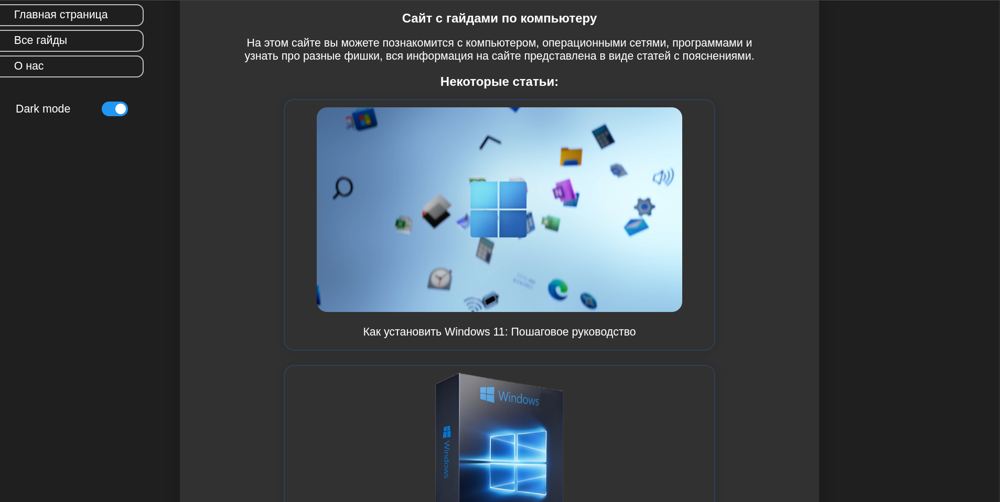

<<<<<<< HEAD
# withcomp.ru — Сайт с гайдами по компьютеру

**withcomp.ru** — это образовательный сайт, посвящённый компьютерам, операционным системам, программному обеспечению и полезным фишкам. Здесь вы найдёте подробные руководства (гайды) в виде статей с пояснениями, которые помогут разобраться в работе с ПК и ОС.

---

 
=======

  
  
<em>Студент | Учу веб-разработку | Создаю портфолио → ищу возможности 🚀</em>

---

###  Мои навыки

---

### 🎯 Цель

Создать **портфолио**, которое откроет двери:  
→ в стажировки 🎓  
→ в open-source 🌍  
→ в первую работу 💼  
→ в команду, где можно учиться и расти 🚀

---

---

### 📬 Связаться со мной

- Telegram: [@bly_41R](https://t.me/bly_41R)  
- GitHub: [@Kirill20202](https://github.com/Kirill20202)  
- Пиши — даже если просто хочешь поболтать о коде 😄
>>>>>>> 46871fc1c6991eb3db7ee520d1120c8236680764

---

<<<<<<< HEAD
## 🌐 Цель проекта

Помочь пользователям любого уровня понять основы работы с компьютером:
- Установка и настройка операционных систем (Windows, Linux, macOS)
- Работа с популярными программами и инструментами
- Полезные советы и "фишки" для повседневного использования

---

## 📚 Что вы найдёте на сайте?

### Операционные системы
- **Linux**: Установка, настройка, работа с терминалом
- **macOS**: Особенности интерфейса, интеграция с Apple-устройствами
- **Windows**: Гайды по Windows 10/11, настройка, обновления

### Программы и софт
- Работа с VS Code, PyCharm, IntelliJ IDEA
- Мультимедиа: VLC, HandBrake, OBS Studio
- Дизайн и графика: GIMP, Inkscape
- Разработка: Git, Docker, Python, Node.js

### Прочее
- Настройка сети, Wi-Fi, брандмауэра
- Безопасность: антивирусы, пароли, двухфакторная аутентификация
- Обзоры и сравнение устройств и ПО

---

## 🖼️ Примеры статей

- Как установить Windows 11: Пошаговое руководство
- Как настроить Linux на ноутбуке
- Лучшие бесплатные программы для Windows
- Как использовать терминал в Linux

---

## 🎨 Дизайн и функциональность

- Поддержка **Dark Mode** (темная тема)
- Адаптивный дизайн (работает на телефонах и ПК)
- Поиск по статьям
- Чёткая навигация: Главная, Все гайды, О нас

---

## 🛠️ Технологии

- HTML, CSS, JavaScript
- Bootstrap / Tailwind CSS (возможно)
- React (если используется)
- Hosting: Vercel, Netlify или собственный сервер

---

## 📝 О нас

Мы — команда энтузиастов IT и технологий, стремящихся сделать знания доступными каждому. Наша цель — упростить обучение и помочь новичкам уверенно чувствовать себя за компьютером.

---

> *© 2025 withcomp.ru — Учись легко, работай эффективно.*
=======
> 🧠 *"Я не знаю всего — и это мой суперпавер. Потому что я учусь быстрее, чем другие думают."*

  
  
  

>>>>>>> 46871fc1c6991eb3db7ee520d1120c8236680764
